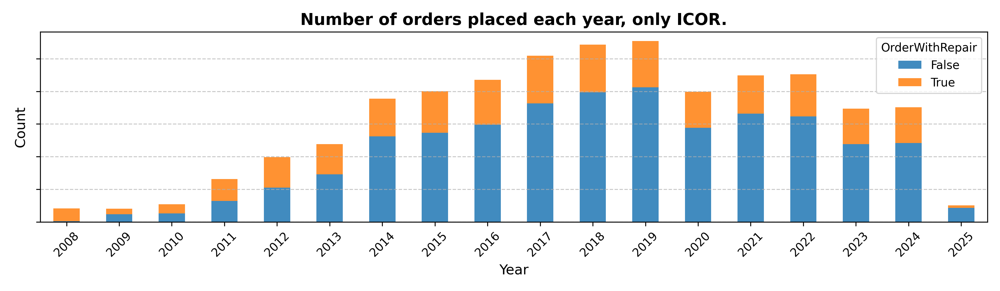

# Medical Equipment Failure & Cost Analysis  
*Franco Pérez Rivera — Data Portfolio Project – 2025*

  
  
  
  

## Table of Contents

0. [Disclaimer](#0-Disclaimer)  
1. [Project Overview](#1-project-overview)  
2. [Project Goals](#2-project-goals)  
3. [Dataset Structure](#3-dataset-structure)  
4. [Executive Summary](#4-executive-summary)  
5. [Insight Deep Dive](#5-insight-deep-dive)  
   - [Data Cleaning and Feature Engineering](#a-data-cleaning-and-feature-engineering)  
   - [SAP Inventory Cleaning](#b-sap-inventory-cleaning)  
   - [Failure Analysis](#c-failure-analysis)  
6. [Recommendations](#6-recommendations)  
7. [Technical Details](#7-technical-details)  
8. [Caveats and Assumptions](#8-caveats-and-assumptions)  

---

## 0. Disclaimer

All information presented in this report has been fully anonymized and modified to protect institutional confidentiality. The results, figures, and conclusions do not represent actual hospital performance and are solely intended for educational and analytical demonstration.

---

## 1. Project Overview

Many hospital networks rely on SAP systems to manage their medical equipment fleet. However, over time, these databases can accumulate inconsistencies, outdated records, and devices that no longer exist in the field. This degrades the reliability of the information, making it harder to track assets, estimate costs accurately, and support critical decisions around replacement, procurement, and maintenance planning.

This project addresses these challenges through a comprehensive data analysis of the equipment inventory and service records. The goal is to support a shift toward more data-driven, transparent, and efficient asset management, combining inventory cleaning, lifecycle analysis, and cost evaluation.

The insights generated through this work are especially valuable for:
- **Procurement teams**, to identify which types or models are underperforming, costly to maintain, or nearing end-of-life.
- **Clinical engineering departments**, to improve maintenance prioritization and ensure the equipment database reflects reality.
- **Administrators and planning units**, to make informed capital investment decisions based on real-world performance.

All findings are presented through an interactive Power BI dashboard that facilitates exploration, validation, and follow-up, helping organizations modernize how they manage their medical technology infrastructure.

You can explore the full interactive dashboard here: [View Power BI Dashboard](https://project.novypro.com/wzKeZ1)

---
## 2. Project Goals

This project was designed around three strategic goals aimed at improving equipment management and data reliability across the hospital network:

**1. Inventory Optimization**
- Identify equipment that likely no longer exists in hospital facilities based on missing location data, prolonged inactivity, or outdated records.
- Detect duplicated entries and structural anomalies within the equipment database.
- Provide actionable insights to improve the accuracy and usability of the equipment inventory.

**2. Failure and Cost Analysis**
- Determine at which points in the lifecycle equipment is more likely to fail or require costly repairs.
- Identify specific models with high failure rates, excessive maintenance frequency, or repair costs that exceed their original purchase value.
- Evaluate cost patterns to support decisions around contract renegotiation and equipment replacement.

**3. Detection of Unusual Equipment Behavior**
- Flag equipment with missing or illogical location assignments, undefined operational statuses, or multiple decommission requests.
- Highlight devices that have not received service in several years, suggesting potential obsolescence.
- Assist in validating inventory against actual hospital assets and identifying potential data governance issues.

Each of these goals is supported by dedicated analytical pipelines and an interactive Power BI dashboard to facilitate decision-making, planning, and cross-departmental coordination.

---

## 3. Dataset Structure

The information used in this analysis is represented in the **Entity-Relationship Diagram (ERD)** above. It summarizes the core datasets involved in the inventory and maintenance evaluation process. All data was cleaned and transformed prior to analysis.

### Table: `df_equipment`

This is the primary dataset containing metadata for all medical devices tracked in the SAP system. Each device is uniquely identified by the field `Equipment_ID`.

- **Device characteristics:** `Type`, `Subtype`, and `ABC` classification (importance and risk level).
- **Manufacturer information:** `Manufacturer`, `Model`, `Serial_number`, and `Purchase_value`.
- **Location and responsibility:** `Hospital`, `Department`, and `Responsible`.
- **Procurement details:** `Purchase_date` and equipment `Device_status`.

### Table: `df_orders`

This table records all maintenance and service orders associated with the equipment.

- **Order types (`Class`):**
  - `ICOR` — Corrective: triggered when a device fails and requires repair.
  - `IPRV` — Internal preventive: scheduled maintenance performed in-house.
  - `IABN` — Outsourced preventive: performed by external service providers.
- **Order cost (`Cost`):**
  - Originally recorded in Argentine pesos.
  - Converted to USD using the blue-market exchange rate from the day of the order.
- **Order date and link to equipment via `Equipment_ID`.**

### Table: `df_dolar`

This table tracks the daily blue-market USD exchange rate used to normalize service costs.

- `Day`: Date of the exchange rate.
- `Value`: Dollar rate in ARS used for conversion.
- Allows full traceability of cost normalization across orders.

### Table: `df_storage`

This auxiliary table helps define the active inventory by linking each hospital to its corresponding material storage location.

- Contains mappings between `Hospital`, `Responsible`, and `Storage`.
- Manually created in Excel based on expert input from logistics and warehouse staff.

### Table: `df_equipment_decomission_request`

This table logs equipment flagged for removal from service.

- Based on form submissions requesting decommission, evaluated by a separate department.
- Fields include:
  - `Created` and `Modified` timestamps.
  - `Status`: pending, approved, or rejected.
- Linked to equipment records via `Equipment_ID`.

  
*Figure 1. ERD showing the structure and relationships between the core datasets used in this analysis.*

---
## 4. Executive Summary

This project provides a data-driven assessment of a hospital network’s medical equipment inventory and maintenance records. The analysis supports modernization efforts by uncovering patterns in equipment performance, service costs, and data inconsistencies.

- Over 10,000 equipment records were cleaned and validated. As a result, **1,477 devices**—representing approximately **4.7%** of total inventory value—were flagged for removal due to inactivity, outdated location assignments, or obsolete status codes.

- Failure analysis showed that **73% of corrective maintenance orders (ICOR)** did not involve an actual repair, suggesting that many service calls may be linked to user error or non-critical issues.

- Although **outsourced maintenance (IABN)** represented only **5%** of all service orders, it accounted for nearly **80%** of total maintenance costs, with a sharp increase observed in 2024.

- A total of **172 devices** accumulated repair costs exceeding their original purchase value, with some models reaching cost ratios above **200%**. These cases indicate low cost-effectiveness and potential candidates for replacement.

- Certain equipment types—such as **T56**, **T131**, and **T29**—presented the highest operational and financial burden, particularly among devices older than 10 years.

- Several devices were also flagged for **unusual patterns**, including missing hospital assignments, inactive status with recent activity, conflicting location codes, or multiple decommission requests.

All results were compiled into an interactive Power BI dashboard that enables exploration, validation, and follow-up. The dashboard supports filtering by hospital, equipment type, manufacturer, and age, providing a comprehensive view of the equipment fleet and its behavior over time.

You can explore the full dashboard here: [View Power BI Dashboard](https://project.novypro.com/wzKeZ1)

---
## 5. Insight Deep Dive

### a. Data Cleaning and Feature Engineering

This phase focused on preparing SAP datasets for analysis by standardizing formats, correcting inconsistencies, and engineering features essential for equipment lifecycle and maintenance evaluation.

These engineered features form the backbone of subsequent analytical models and dashboards.

---

#### 1. Data Cleaning

Each SAP dataset (`equipment`, `orders`, `storage`, `decommission requests`) was cleaned individually using reusable functions:

- Removed irrelevant or duplicate columns and rows.
- Handled missing values and standardized column names.
- Filtered technical locations to only include active hospital units (e.g., starting with `"IC"`).
- Fixed invalid entries such as a purchase year of `2201`, corrected to `2017`.

Example: All purchase dates were converted to `Purchase_year`, and missing or pre-2005 entries were defaulted to `2005` to reflect acquisitions prior to SAP implementation.

---

#### 2. Feature Engineering

Several new variables were generated to enrich the analysis:

- **Cost normalization**: Service order costs were converted to USD using historical dollar rates (`Cost_in_dollar`).
- **Equipment age**: Calculated the equipment age at the time of each service order (`Equipment_age`).
- **Repair flag**: A binary flag (`OrderWithRepair`) was created to indicate whether the order involved a repair (`Cost > 0`).
- **Last maintenance year**: A new column (`Last_order_year`) was added to the equipment table to reflect the most recent service.
- **Decommission status**: A binary field (`Decommission_request`) was created by matching devices against the decommission request database.
- **Price imputation**: For equipment with missing or zero `Purchase_value`, average values by model were used for imputation.

---

### b. SAP Inventory Cleaning

With the data cleaned and features engineered, the next step involved auditing the hospital’s SAP inventory to detect obsolete, duplicate, or inconsistent records. The cleaning was performed in three stages: removal candidates, flagged equipment for further analysis, and duplicate detection.  

To make the results accessible and actionable, all flagged records were integrated into a custom interactive Power BI dashboard.

The cleaned and validated inventory now serves as a reliable foundation for cost and failure analysis across the fleet.

---

#### 1. Decommission Candidates

A set of rules was applied to detect devices ready for removal:

- **No Hospital Assignment:** 159 devices had no hospital data and no recent service history.  
- **Decommissioned Locations (BAJA):** 11 devices located in obsolete or undefined warehouses were removed.  
- **NOEN Status:** 182 devices not found in recent inventory checks and with outdated or missing service data were removed.  
- **Old and Inactive Equipment:** 371 devices purchased before 2013 and 1,267 with no service orders after 2013 were eliminated.  
- **Multiple Decommission Requests:** 117 devices flagged multiple times for removal were discarded.

A total of **1,477 devices** were recommended for removal (≈4.7% of total inventory value).

>   
> *Figure 2. Devices selected for removal by cleaning rule.*

>   
> *Figure 3. Distribution of flagged devices by hospital, type, last order year, and purchase year.*

---

#### 2. Equipment Flagged for Analysis

Some devices did not fully meet removal criteria but still warranted review:

- **Recently active devices** with no hospital assigned (23).
- **Devices in BAJA hospitals** but with recent activity (3).
- **NOEN-labeled equipment**, either very old (77 units before 2008) or recently purchased (18 units after 2020).
- **Old devices with partial data or late service** (1,074 total).
- **Recent decommission requests on new equipment** (9).

>   
> *Figure 4. Devices marked for further evaluation by reason category.*

---

#### 3. Duplicate Detection

An additional check was performed on serial numbers:

- 26 devices were identified with matching serial numbers and identical manufacturer/model combinations.
- Some inconsistencies were also observed between Equipment ID formatting and serial numbers.

---

#### 4. Power BI Dashboard

To support cross-validation and decision-making based on the SAP cleaning process, a fully customized **Power BI dashboard** was developed. It integrates both raw inventory data and the outputs from the Python-based cleaning pipeline, offering interactive exploration of the hospital network’s medical equipment.

---

##### Core Functionalities

The dashboard is designed to provide a comprehensive and interactive view of the hospital's medical equipment inventory. It allows users to:

- **Filter and explore equipment** by key dimensions such as:
  - Hospital  
  - Department  
  - Equipment type and subtype  
  - Manufacturer and model  
  - Purchase year and last order year  

- **Visualize inventory characteristics** through:
  - **Bar charts** showing the distribution of equipment by purchase year (to assess fleet aging), and last service year (to identify when devices were last maintained).
  - **Breakdowns** by type, manufacturer, and model to detect concentration trends or potential standardization opportunities.
  - **Time series charts** to analyze how the total number of devices evolved over time, globally and by hospital, department, type, or manufacturer.

- **View analysis results from Python**, including:
  - Devices recommended for decommission based on age, inactivity, or missing data.
  - Potential duplicate entries based on serial number and model combinations.

- **Use advanced analysis visuals** to evaluate:
  - **Failure frequency**: Number of service orders per device per year.
  - **Maintenance burden**: Annual cost of service orders by order type (e.g., corrective, preventive, outsourced).
  - **Lifecycle behavior**: Equipment age at time of order, to understand when devices are more likely to fail, require costly repairs, or need frequent maintenance.

- **Access a detailed table** with full metadata per equipment, supporting audits and individual record validation.

>   
> *Figure 5. Main dashboard view with filters, navigation, and complete equipment table. Includes KPIs: total equipment, devices to remove, and duplicates.*

---

##### Flagged Equipment Exploration

Users can interactively explore flagged records (`Advanced-analysis` filter), whether:

- **Marked for decommission** due to age, inactivity, or requests.
- **Suspected duplicates** based on matching serial numbers and model data.

>   
> *Figure 6. Equipment flagged for removal over time, per hospital. H1 and H2 exhibit the steepest growth.*

---

##### Maintenance & Cost Analysis

The `Orders – Trends` section provides additional insights:

- **Annual order cost per device**, segmented by order type (`ICOR`, `IABN`, `IPRV`).
- **Repair frequency over time** by age group.
- **Service cost lifecycle**, highlighting when devices become financially inefficient.

>   
> *Figure 7. Weighted maintenance cost over time, showing a significant peak in 2024.*

---

##### Summary Metrics

Key indicators are displayed to summarize the inventory status:

- Total number of active devices.
- Number of devices flagged for removal.
- Number of suspected duplicates.

These interactive tools enable both technical and administrative stakeholders to:

- Prioritize decommissioning and replacement planning.
- Identify high-cost equipment early.
- Ensure data quality and traceability in SAP.

---

### c. Failure Analysis

The final stage of the project focused on identifying failure trends and cost inefficiencies across the equipment fleet, to support more informed decisions regarding preventive maintenance, decommissioning, and vendor negotiations.

---

#### **Order Trends and Class Distribution**

>   
> *Figure 8. Number of orders placed each year, split by order class.*

From 2008 to 2025, most orders were either **corrective (ICOR)** or **preventive (IPRV)**, comprising over **95%** of all maintenance actions. A clear drop is observed in 2020, likely due to reduced clinical activity during the COVID-19 pandemic. After 2020, order volumes remained high, indicating persistent maintenance demand.

---

#### **Repair-Free Corrective Orders**

>   
> *Figure 9. Number of ICOR orders with and without associated repairs.*

Surprisingly, **73% of corrective orders (ICOR)** had **no associated cost**, suggesting that many service calls were caused by **user errors** or **non-critical issues**. This highlights a potential opportunity to reduce costs through **training and process optimization**.

---

#### **Repair Cost by Order Class**

>   
> *Figure 10. Total cost of orders by class, per year.*

While **IABN (outsourced services)** represents only **~5% of orders**, it accounts for nearly **80% of total maintenance costs**, peaking sharply in **2024**. This cost concentration suggests a critical need to **review external service contracts**.

---

### **Failures Across the Equipment Lifecycle**

One of the main goals was to determine **when in their lifecycle equipment tends to fail**, and whether there’s a predictable cost pattern over time.

>   
> *Figure 11. Failure rate by equipment age (ICOR only, weighted).*

The analysis revealed that most failures occur between **3 and 6 years** of equipment age. This is likely the "wear-in" phase where early degradation becomes apparent.

>   
> *Figure 12. Average repair cost by age (ICOR only, weighted).*

However, the **repair cost per device increases with age**, with distinct cost spikes around **6, 16, and 19 years**. This suggests that even if failure frequency drops over time, older equipment is **more expensive to maintain**, reinforcing the importance of **strategic decommissioning** around these lifecycle points.

---

### **Repair Cost vs. Purchase Value**

>   
> *Figure 13. Devices with repair costs exceeding purchase value (red above diagonal).*

By comparing total repair expenses with initial purchase prices, **172 devices** were found to have **surpassed their original value in repairs**. These cases are **urgent candidates for replacement**.

---

### **Model-Level Risk Evaluation**

>   
> *Figure 14. Top 15 models with the highest repair-to-purchase cost ratio.*

Model **M107** stands out with repair costs at **293.2%** of its original price. Other models such as **M269**, **M554**, and **M195** also show excessive cost ratios. These results suggest potential **design issues** or **long-term inefficiencies**.

---

#### Top Equipment with Extreme Repair-to-Cost Ratios

| Type | Manufacturer | Model | Units | Repairs | Repair/Purchase Ratio (%) |
|------|--------------|--------|--------|---------|----------------------------|
| T52  | F157         | M107   | 15     | 58      | 293.2%                     |
| T59  | F18          | M269   | 11     | 34      | 82.6%                      |
| T24  | F77          | M554   | 5      | 26      | 79.4%                      |
| T2   | F125         | M195   | 14     | 161     | 79.1%                      |
| T35  | F32          | M446   | 6      | 109     | 76.5%                      |
| T91  | F15          | M303   | 10     | 81      | 65.1%                      |

> *Note:* M107 appears with multiple manufacturers, confirming it's a high-risk model across suppliers.  
> Models like **M195** and **M446** show both high repair counts and cost ratios, suggesting they are no longer cost-effective to maintain.

>   
> *Figure 15. Table of top individual equipment with extreme repair ratios.*

This table zooms into specific units with the highest cost burden, including devices that exceeded **4000%** of their purchase value due to either **very expensive repairs** or **very low initial cost**. These units are critical candidates for urgent replacement.

### **Type-Level Risk Detection**

To identify equipment categories that present systematic maintenance problems, we analyzed failure behavior by **type**.

>   
> *Figure 16. Weighted number of repair orders per equipment type (2020–2024).*

Types **T131**, **T29**, and **T56** show the highest frequency of repair orders, adjusted by number of units in service. This suggests high operational burden within those categories.

>   
> *Figure 17. Top 10 types with the highest failure rate (% of units that failed).*

Failure rates above **70%** were observed across all listed types, with **T125**, **T42**, and **T56** standing out as the most failure-prone.

To complement this, we ranked these types by **average repair cost** (see table below), combining the failure frequency with the economic burden.

---

#### Summary Table – Risky Types by Failure Rate, Cost and Age

| Type  | Equip. Units | Failure Rate (%) | Repairs | Avg. Age (yrs) | Relative Cost Rank |
|-------|---------------|------------------|---------|----------------|---------------------|
| T131  | 5             | 80.0             | 37      | 8.2            | **#1**              |
| T100  | 13            | 76.9             | 33      | 7.5            | **#2**              |
| T110  | 10            | 70.0             | 25      | 11.2           | **#3**              |
| T56   | 49            | 81.6             | 176     | 11.6           | #4                  |
| T125  | 7             | 100.0            | 17      | 12.9           | -                   |
| T42   | 79            | 83.5             | 183     | 13.1           | -                   |
| T29   | 95            | 71.6             | 439     | 10.1           | -                   |
| T77   | 19            | 78.9             | 41      | 12.9           | -                   |

> *Note:* Cost ranking is derived from average repair cost data (not shown here, see Figure 11 in full report).  
> Types **T131**, **T100**, and **T110** are particularly costly despite having a smaller number of units, increasing per-unit repair burden.

This analysis enables prioritization of **type-level interventions**, either through replacement, contract negotiation, or enhanced maintenance protocols.

### **Model-Level Failure Risk**

>   
> *Figure 18. Number of corrective orders per model (2020–2024), weighted by units.*

Models **M419**, **M51**, and **M381** show the highest volume of corrective orders in recent years, with over 6 weighted repairs each. This early signal suggests potential reliability issues in the field.

>   
> *Figure 19. Top 15 models with the highest failure rate (2020–2024).*

Every model shown reached a **failure rate of 100%**, except for M51 (97.7%). Models like **M446**, **M381**, and **M419** consistently appeared at the top, indicating systemic reliability problems.

>   
> *Figure 20. Models ordered by average repair cost (USD).*

These same models also ranked highest in **average repair cost**, with **M446** and **M381** being the most expensive to maintain.

#### Summary of High-Risk Models

| Model   | Failure Rate | Avg. Repair Cost | Avg. Age | Notes                                       |
|---------|--------------|------------------|----------|---------------------------------------------|
| **M446** | 100%         | Highest overall  | 11.2     | Highest cost + 100% failure                 |
| **M381** | 100%         | 2nd highest      | 12.7     | Expensive and high failure volume           |
| **M419** | 100%         | Top 3            | 10.7     | Consistent across all risk metrics          |
| **M386** | 100%         | High             | 16.6     | Older units with expensive failures         |
| **M303** | 100%         | Mid-High         | 7.4      | Lower age, still total failure              |
| **M51**  | 97.7%        | Moderate         | 13.4     | Very frequent repairs despite lower cost    |
| **M195** | 100%         | Lowest of group  | 13.0     | Not expensive, but frequent total failures  |

This multi-dimensional analysis—combining order volume, failure rates, and repair cost—helps flag models that should be considered for **preventive audits, contract renegotiations**, or even **replacement planning**.

### **Model-Level Cost Burden**

  
*Figure 21. Top 15 models with the highest repair-to-purchase cost ratio (ICOR).*

The **M107** model is the most financially concerning, with repair costs reaching **293.2%** of its purchase value. Other models such as **M269**, **M554**, **M195**, and **M446** also show extremely high cost ratios, potentially indicating poor reliability, outdated components, or unusually expensive repairs.

Below is a condensed summary of the most critical models:

| Model | Repair/Cost Ratio (%) | Repairs | Units | Notes                             |
|-------|------------------------|---------|--------|------------------------------------|
| M107  | 293.2%                 | 58      | 15     | Highest burden,     |
| M269  | 82.6%                  | 34      | 11     | Moderate volume, expensive upkeep |
| M554  | 79.4%                  | 26      | 5      | High cost despite low quantity     |
| M195  | 79.1%                  | 161     | 14     | Very high repair volume            |
| M446  | 76.5%                  | 109     | 6      | Consistent high-cost issue         |
| M303  | 65.1%                  | 81      | 10     | High frequency and cost            |
| M322  | 62.1%                  | 5       | 7      | Low usage, still high cost         |
| M199  | 58.2%                  | 32      | 9      | Repeated failures across types     |
| M252  | 50.5%                  | 13      | 9      | Appears twice, consistently costly |
| M102  | 49.7%                  | 146     | 21     | Large fleet, high total burden     |

These models should be prioritized for further evaluation, redesign, or potential phase-out strategies due to their **disproportionate maintenance costs**.

## 6. Recommendations

Based on the insights obtained from the equipment inventory, failure trends, and cost analysis, the following strategic actions are recommended. These are grouped according to the three core areas of analysis:

---

**1. Inventory Optimization**

- Regularly audit the equipment database to remove outdated or inactive records and ensure accurate hospital and department assignments.
- Investigate and resolve duplicated entries—especially those with matching serial numbers and inconsistent metadata.
- Implement a standardized protocol for updating equipment status and location fields across all facilities.

---

**2. Failure and Cost Analysis**

- Prioritize the replacement of devices whose cumulative repair cost exceeds their original purchase value.
- Review and renegotiate outsourced maintenance contracts, particularly for equipment with high external service costs and low repair yield.
- Use lifecycle trends (e.g., failure spikes at 6, 16, and 19 years) to anticipate when equipment becomes inefficient to maintain and plan replacements in advance.
- Focus preventive maintenance and technical audits on models with high failure frequency or cost indicators.

---

**3. Detection of Unusual Equipment Behavior**

- Validate all equipment with undefined or missing location data, especially if flagged as active in the system.
- Investigate devices with multiple decommission requests or prolonged inactivity, as these may no longer be in service.
- Establish periodic checks for equipment with unclear operational statuses or inconsistent metadata, to prevent data drift in the inventory system.

---

These actions will contribute to more accurate data management, cost-efficient maintenance, and improved long-term planning across the hospital network.

## 7. Technical Details

This project was implemented using Python and Power BI, combining data processing, exploratory analysis, and interactive visualization.

### a. Technologies and Libraries

- **Data Processing:** `pandas`, `numpy`, `datetime`, `re`
- **Visualization & Reporting:** `matplotlib`, `seaborn`, `plotly`, `Power BI`
- **Analysis & Cleaning:** Custom Python functions for rule-based cleaning, equipment matching, and type/model aggregation
- **Dashboarding:** Power BI connected to cleaned datasets for full interaction and filtering capabilities

### b. Dataset Sources and Transformations

Four SAP-based datasets were used:

- `equipment`: Metadata and purchase information
- `orders`: Historical maintenance records
- `storage`: Warehouse and hospital location data
- `decommission_requests`: Manual decommission reports

Key transformations included:

- Cost normalization to USD (historical conversion)
- Equipment age calculation per order
- Failure classification and service flagging
- Aggregation of repair frequency and cost by model and type

### c. Outputs and Deliverables

- A cleaned and standardized master dataset with analytical features
- A multi-page Power BI dashboard for inventory and cost analysis
- Visuals and figures exported for reporting and executive presentation

---

## 8. Caveats and Assumptions

Several assumptions and limitations should be considered when interpreting the findings of this project:

- **Anonymization and structural modifications:** All data has been modified for confidentiality. Results do not reflect the real operational status of any specific institution.
- **Purchase value imputation:** Missing purchase prices were filled using average values by model, which may introduce estimation errors.
- **Repair definition:** Only service orders with a recorded cost > 0 were considered true repairs; some low-cost or undocumented repairs may be excluded.
- **Type and model standardization:** Equipment types and models were standardized across institutions based on naming rules, which may group devices with technical differences under a shared label.
- **Limited manufacturer-level analysis:** This version of the project does not evaluate performance by vendor, although manufacturer data is available.
- **Historical currency adjustment:** Cost normalization to USD was based on estimated annual rates; exact conversion values may vary.

Despite these limitations, the approach provides a reliable framework to prioritize further investigation, planning, and resource allocation.
